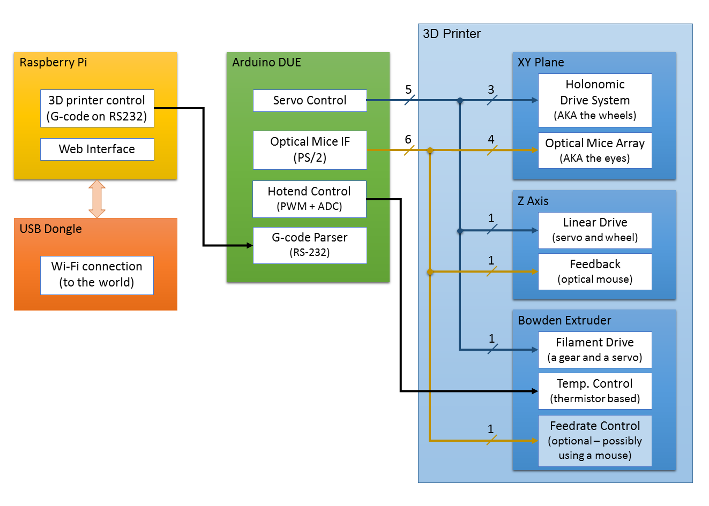

DeadBot
=======

This is the GitHub repository for the "Cheap and Easy to Build 3D Printer" project that I also nicknamed DeadBot.

It is about a very unorthodox way to build a 3D printer using a turned upside down holonomic robot to move the XY plane, and employing an array of optical mice for closed loop control.

This is an ongoing project that I am documenting on hackaday.io website.

For more details you can follow the project at:
http://hackaday.io/project/1544-Cheap-and-Easy-to-Build-3D-Printer

System Diagram
--------------

